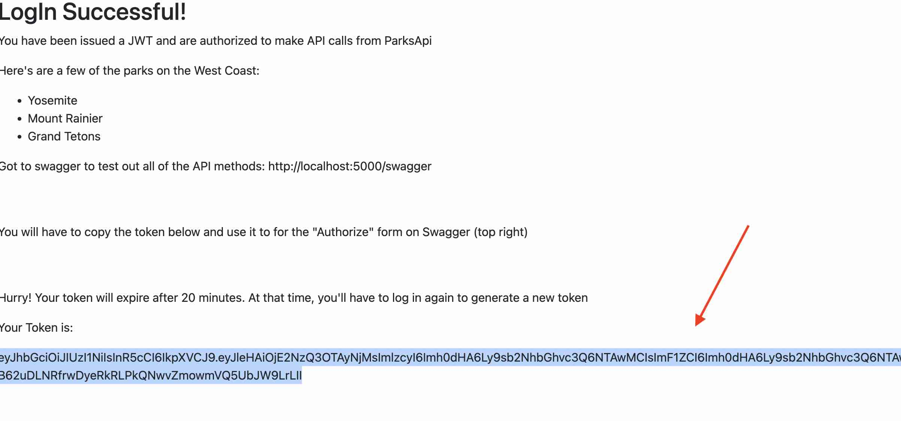
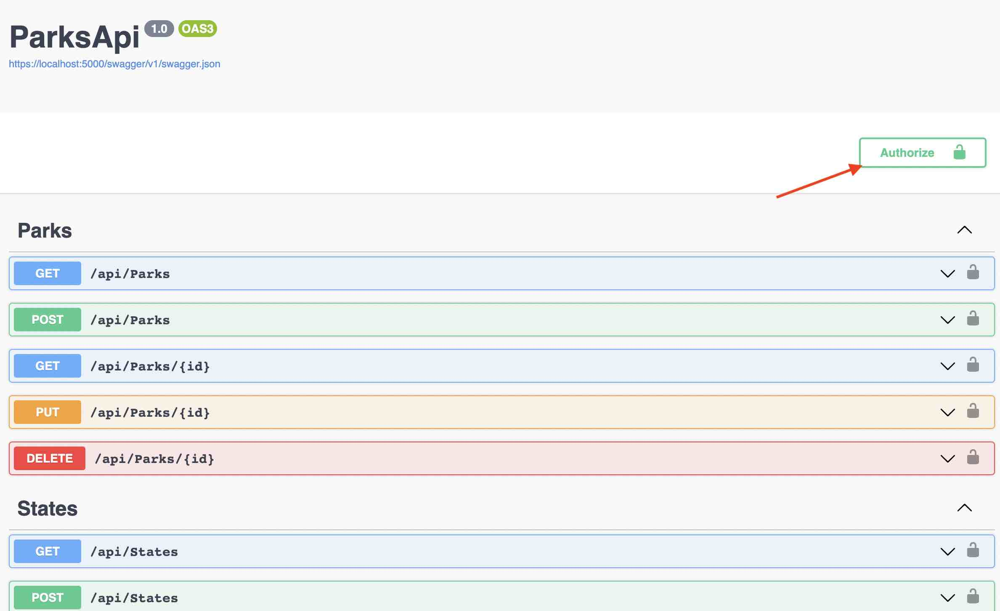
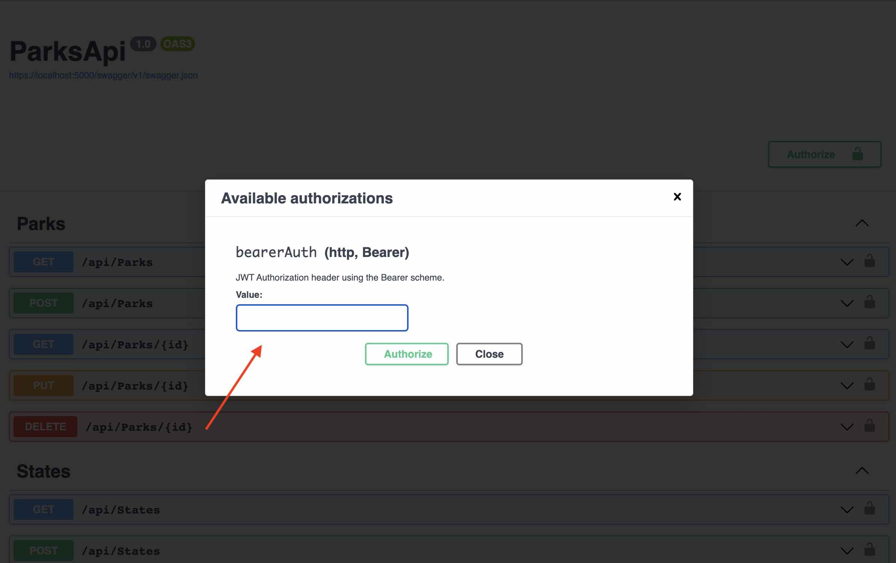
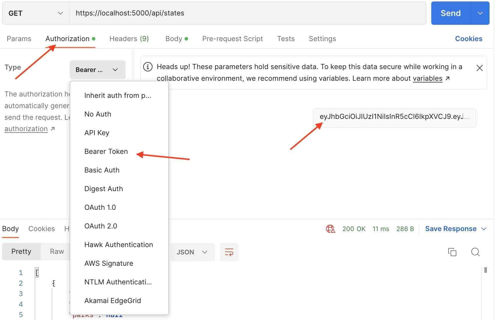
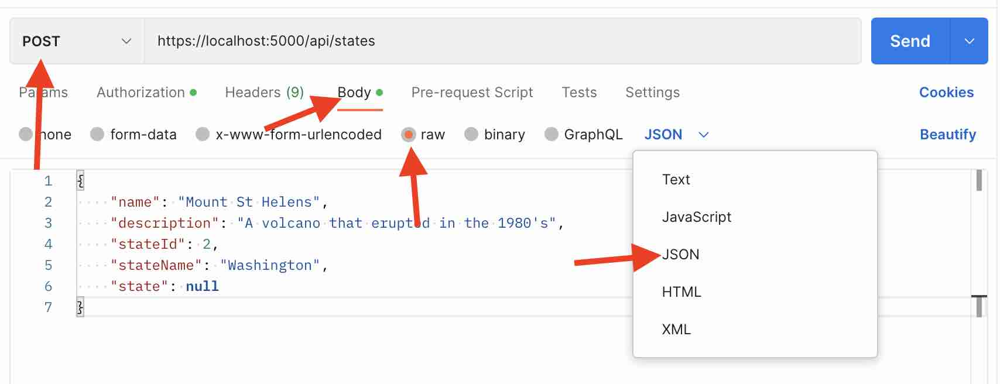

# _Parks API_

#### By _Robert Onstott_

#### _Parks API is a service to provide information about state and national parks in the US. Parks are searchable by the state in which they or located or by park name, using a search query. The API incorporates authentication with a JWT Bearer token, which is generated at the login page. The JWT token is not fully functional at this time, due to unresolved problems with authorizations and permissions, so the `[Authorize]` attributes have been commented out for the controller classses_

## Technologies Used

* _C# and .NET 6.0_
* _ASP.NET core MVC_
* _Entity Framework Core_
* _MySQL community server_
* _MySQL Workbench_
* _VS Code_
* _Github_
* _Swagger_
* _JWT Bearer_

## Description

_This is an API application that returns information about state and national parks in the US. You can call to see a list of all parks within a given state, see information about a specific park, or you may use a search query to return a park by the park's name. There are also API call methods to add, update, and delete parks from the database. Parks are associated with the states via a many-to-many relationshi, so there are also API call methods to view, update, and delete the states, as a means of organizing the park data. Parks API is built with the ASP.NET Core web development framework, utilizing Entity Framework Core for mapping C# object classes into SQL database schemas. This also maps ASP.NET controller methods onto API caller methods. For the purposes of development, the database is hosted through a local server using MySql._

 -------------------------------------------------------------------------------------------------------------------------------------------------------

# General Setup

* _Download the .NET framework if you do not already have it (version 6.0 or later)_
 
  _https://dotnet.microsoft.com/en-us/download/dotnet_
  
* _Download MySQL Community Server and MySQL Workbench if you don't already have them (both from this link). Make note of both the `User ID (UID)` and the `Password (PWD)` that you define in your setup configurations for MySQL. These values will go into your `appsettings.json` file in a few steps_
  
    _https://dev.mysql.com/downloads/_
  
* _Clone this repository to your machine_

* _Open the repository and navigate to the `ParksApi` directory one level down from the root directory: `$ cd ParksApi`  and create a new file called `appsettings.json`. Copy the following code into the file, with your own values for `uid` and `pwd`_
 
 
  
  ```
      {
        "Logging": {
          "LogLevel": {
             "Default": "Information",
             "Microsoft.AspNetCore": "Warning"
          }
        },
        "AllowedHosts": "*",
        "ConnectionStrings": {
           "DefaultConnection": "Server=localhost;Port=3306;database=parks_api;uid=[Your User ID];pwd=[Your Password];"
        }
      } 

  ```  
  
* _Entity Framework Core has tools to automatically build the database schema utiliaing object mapping. While still in the lower `ParksApi` directory, enter the following command_

```
    $ dotnet ef database update   
```

* _While still in the `ParksApi` directory, enter the command `$ dotnet run`. This will start the local web server._
  
  ```
        $ dotnet run
               
  ```   
  
* _With the server running, you are now able to make API calls. There is no custom interface for interacting with the API calls. You can make calls directly in your browser using the endpoints documented below. You may also test the calls using Postman, also with the endpoints documented below. Finally, you may use Swagger, by entering the URL https://localhost:5000/swagger. If you use swagger, the API calls are NOT made by manually adjusting the URL. There is a User Interface on the swagger page, where you select the type of call that you want to make by clicking buttons. For the calls that have search query parameters, there are form inputs for adding the query parameters._

 -------------------------------------------------------------------------------------------------------------------------------------------------------


# API Endpoints
Base URL: `https://localhost:5000`

## HTTP Request Structure
```
GET /api/{component}
POST /api/{component}
GET /api/{component}/{id}
PUT /api/{component}/{id}
DELETE /api/{component}/{id}
```

 -------------------------------------------------------------------------------------------------------------------------------------------------------

# Parks
Access information on state and national parks in the US

## HTTP Request
```
GET /api/Parks
POST /api/Parks
GET /api/Parks/{id}
PUT /api/Parks/{id}
DELETE /api/Parks/{id}
```

## GET Requests
_Get requests can return ALL parks `https://localhost:5000/api/Parks`, they can return a single park based on ID `https://localhost:5000/api/parks/2`, or they can return a subset of the parks based on a search query `https://localhost:5000/api/Parks/?name=rain&stateName=wa`._

### Search Query Parameters
| Parameter | Type | Default | Required | Description |
| :---: | :---: | :---: | :---: | --- |
| name | string | none | false | Return matches by name. Partial queries supported, so long as name contains query |
| stateName | string | none | false | Return any parks whose stateName property contains query  |

### Example GET Query URL
```
https://localhost:5000/api/Parks/?name=rain&stateName=wa

```

### Sample JSON GET Response
```
{
  "parkId": 3,
  "name": "Mount Rainier",
  "description": "A 14,410 active volcano with extensive (but shrinking) glacier fields. Beloved for alpine meadows carpeted in summer wildflowers",
  "stateId": 2,
  "stateName": "Washington",
  "state": null
}

* note: "state" is a navigation property for EF Core and will always be null
```

## POST Requests
_To POST a new park entry, you will enter the URL `https://localhost:5000/api/Parks` along with a JSON body for the entry that you are making. Note that you must not inlcue a "parkId" parameter, because this is automatically assigned by the database. You also do not need to enter a "state" parameter because this is a navigation property for EF core and will always be null_

### Sample POST URL
```
https://localhost:5000/api/Parks
```

### Sample POST JSON Body
```
{
  "name": "Mount Shasta",
  "description": "A very tall volcano in northern California",
  "stateId": 3,
  "stateName": "California"
}
```

## PUT Requests
_Use a PUT request to edit an existing entry. Use the URL `https://localhost:5000/api/Parks/{id}. Even if you are only editing one parameter of the object, you must provide an entire JSON body, including all unchanged fields. This seems redundant, but is necessary. Note that, unlike for POST requests, you absolutely MUST include a parkId property, because this is how the database knows WHICH entry you are updating. State can still be omitted, because it is a navigation property and it is null._

### Sample PUT URL
```
https://localhost:5000/api/Parks/3
```

### Sample PUT JSON Body
```
{
  "parkId": 3,
  "name": "Mount Rainier",
  "description": "This park is in Washington, not California, but I've chosen to update this once truthful entry and turn it into a lie. Note that parkId is included and is the same as before.",
  "stateId": 3,
  "stateName": "California"
}
```

## DELETE Requests
_You can delete a specific entry by using the DELETE method and including, in the URL, the parkId of the entry that you want to delete._

### Sample DELETE URL

```
https://localhost:5000/api/Parks/3

*This will delete "Mount Rainier" (parkId: 3) from our database
```

 -------------------------------------------------------------------------------------------------------------------------------------------------------

# States

## HTTP Request
```
GET /api/State
POST /api/State
GET /api/State/{id}
PUT /api/State/{id}
DELETE /api/State/{id}
```

## GET Requests
_GET requests can return ALL states `https://localhost:5000/api/States`, they can return a single state based on ID `https://localhost:5000/api/States/2`, or they can return a subset of the states based on a search query `https://localhost:5000/api/States/?name=washington`._

## Search Query Parameters
| Parameter | Type | Default | Required | Description |
| :---: | :---: | :---: | :---: | --- |
| name | string | none | false | Return matches by name.

## Example GET Query URL
```
https://localhost:5000/api/States/?name=washington
```

## Sample JSON Response for GET
```
  {
  "stateId": 2,
  "name": "Washington",
  "parks": [
    {
      "parkId": 3,
      "name": "Mount Rainier",
      "description": "A 14,410 active volcano with extensive (but shrinking) glacier fields. Beloved for alpine meadows carpeted in summer wildflowers",
      "stateId": 2,
      "stateName": "Washington",
      "state": null
    }
  ]
}
  
```

## POST Requests
_To add a new state entry to the database. Note that `stateId` will be generated automatically by the database, and should be omitted entirely. `Parks` can be also be omitted, because it is represents a many-to-many relationship that is fulfilled automatically by the join entities in EF CORE_

## Example POST URL
```
https://localhost:5000/api/States
```

## Example POST JSON body

```
  {
    "name": "Washington"
  }
```

## PUT Requests
_Use a PUT request to edit an existing entry. Use the URL `https://localhost:5000/api/States/{id}`. Even if you are only editing one parameter of the object, you must provide an entire JSON body, including all unchanged fields. This seems redundant, but is necessary. Note that, unlike for POST requests, you absolutely MUST include a `stateId` property, because this is how the database knows WHICH entry you are updating. `Parks` can be omitted, because it is a many-to-many relationship that is fulfilled automatically by the join entities in EF CORE_

## Example PUT URL
```
https://localhost:5000/api/States/2
```
## Example PUT JSON Body
```
  {
    "stateId": 2,
    "name": "Washing-TUN"
  }
```
## DELETE Requests
_You can delete a specific entry by using the DELETE method and including, in the URL, the stateId of the entry that you want to delete._

### Sample DELETE URL

```
https://localhost:5000/api/States/2

*This will delete "Washing-TUN" (parkId: 2) from our database
```

-------------------------------------------------------------------------------------------------------------------------------------------------------

## Known Bugs

* _JWT bearer tokens are not working at this time. The tokens are are issued, but due to an unresolved configuration issue they do not grant permission on any computer but my own. For that reason, the JWT [Authorize] attributes are commented out at the top of each the controller claseses_

-------------------------------------------------------------------------------------------------------------------------------------------------------

 # Logging In And Getting Your Token (Disregard This Section, JWT Not Working)
  
 ```
 The JWT token is not currently functional
 ```
 
 ```
 You may SKIP the LOGIN & JWT TOKEN steps and go straight to making API calls with Swagger or Postman
 ```
  
 * _This will direct you to the login page. This is a dummy login that is not actually secure-- it is a placeholder in order to build out the JWT issuing    and authentication functionality. The username and secret are both the same word: `secret`._
 
 ```
  username: secret
  password: secret
 ```
 
 * _This will direct you to a "Log In Successful" page, where you will be given the text of your JWT bearer token. Copy this token to your clipboard._
 
 
 
 * _From here on, there is no custom user interface for the API. To test API calls, you must use the Swagger UI or Postman. Make sure that you have the JWT token copied to your clipboard for either method:_
 
 -------------------------------------------------------------------------------------------------------------------------------------------------------
 
 # Swagger Authorization (Disregard This Section. JWT Not working.)
 
 * _Enter the following URL into your browser_
 
 ```
    https://localhost:5000/swagger
 ``` 
 * _On the Swagger page, you will see tabs for all of the API endpoints, organized by the two database tables: `Parks` and `States`. Click the green `Authorize` button at the top right corner of the page._
 


* _Enter the JWT that you copied before. You may now click any of the endpoints and will be authorized to make API calls. Refer to the sections below for documentation of all API endpoints. By clicking on the tabs that are labeled with the different API methods, you can select the type of API request method that you want to use. You do not need to manually enter the URL, because the Swagger UI provides text boxes for each request type, as needed. Refer to the documentation below. Note that for PUT and POST requests you need to enter a JSON body formatted appropriately for the class that you are referencing. Details are in the documentation below._



 -------------------------------------------------------------------------------------------------------------------------------------------------------
# Postman Authorization (Disregard This Section. JWT Not Working.)

* _Open the Postman App and open a new tab. You will need your JWT for Postman as well. Click `Authorization` on the top bar, then select `Bearer Token` from the dropdown tab that says "Type" and then enter your token into the input field on the right_



* _You can now make API calls by selecting the controller method and entering the URL according to the endpoints outlined below. PUT and POST requests are more involved because you have to include the entire JSON body of your update to the database. For PUT and POST requests, select the controller type and enter the URL as for GET requests, then select `Body` from the toolbar above, check `Raw`, and then choose `JSON` from the dropdown list on the right. Then enter the body of your request. If it is a POST request, do not enter a ParksId or a StatesId--these are automatically generated. But if it is a PUT request, leave the ID the same_


 
 -------------------------------------------------------------------------------------------------------------------------------------------------------

## License

_MIT_

_Permission is hereby granted, free of charge, to any person obtaining a copy of this software and associated documentation files (the "Software"), to deal in the Software without restriction, including without limitation the rights to use, copy, modify, merge, publish, distribute, sublicense, and/or sell copies of the Software, and to permit persons to whom the Software is furnished to do so, subject to the following conditions:_

_The above copyright notice and this permission notice shall be included in all copies or substantial portions of the Software._

_THE SOFTWARE IS PROVIDED "AS IS", WITHOUT WARRANTY OF ANY KIND, EXPRESS OR IMPLIED, INCLUDING BUT NOT LIMITED TO THE WARRANTIES OF MERCHANTABILITY, FITNESS FOR A PARTICULAR PURPOSE AND NONINFRINGEMENT. IN NO EVENT SHALL THE AUTHORS OR COPYRIGHT HOLDERS BE LIABLE FOR ANY CLAIM, DAMAGES OR OTHER LIABILITY, WHETHER IN AN ACTION OF CONTRACT, TORT OR OTHERWISE, ARISING FROM, OUT OF OR IN CONNECTION WITH THE SOFTWARE OR THE USE OR OTHER DEALINGS IN THE SOFTWARE._

Copyright (c) January 2023_ _Robert Onstott_
